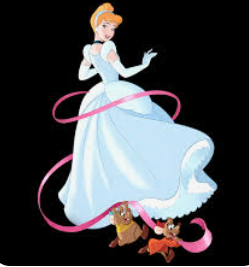

# Princess-Diary
This repository makes a graphic novel using generative AI along with latest tools adobe firefly, canva and midjourney.
#### Graphic images generated by: Akanksha Agnihotri
## What is the question you are solving?

The question I am solving is how to create a compelling novel based on the variety of images of different kinds of Disney Princess. I want to develop engaging and consistent characters for my story, ensuring that they have depth and resonance with the readers .

## Why is it interesting ?

This is interesting because it helps us to leverage the recent technology of Generative AI to apply in AI artistic skills and helps us to think creatively about the characters that are being involved . Hence leveraging the skills that I have learnt in Machine Learning – Deep Learning can be utilized here to understand how generative AI is being used. 

## How are you doing it?

I am using a combination of AI tools including ChatGPT, Midjourney, Adobe FireFly and Canva. First, I utilized ChatGPT to generate initial content and ideas of how to make thier story more intresting as already disney princess have great graphics. Hence by this i can get idea to modify their orginality without loosing the grip of the story. Then, I used Midjourney to create a main character by inputting specific traits and characteristics. Once I found a suitable character, I obtained the image ID and seed ID from Midjourney for consistency in generating new images of the character. Canva was used for visual representation and design aspects of the characters and the story.

## What are your results?

I have successfully generated consistent and engaging characters for different phases of the main princess's life. The characters have depth, unique traits, and compelling story arcs, making them relatable to the readers. The visual representation through Canva adds an extra layer of depth to the characters, enhancing the overall storytelling experience.

## How do you know your results are good?

I consider my results good based on the following criteria:

- Consistency: The characters generated using Midjourney consistently align with the initial traits and characteristics I specified, ensuring continuity and coherence in the story.

- Engagement: The characters developed through this process are engaging, with detailed backgrounds and motivations. They evoke emotional responses from the readers, which is a sign of effective character development.

- Visual Appeal: The visual representation of the characters using Canva enhances their appeal. Aesthetically pleasing and visually coherent characters are more likely to capture the readers' attention and imagination.

- Reader Feedback: To further validate the quality of my results, I can gather feedback from beta readers or writing communities. Positive feedback regarding the characters' relatability and depth would indicate the success of my approach. Also i would be editing few images to make characters more interesting hence it is necessary
to get the necessary feedback .

- Story Flow: As I integrate these characters into my novel, I can assess how smoothly they fit into the storyline. If the characters seamlessly integrate into the plot and contribute meaningfully to the narrative, it indicates the success of the character development process.

By considering these factors, I can confidently assert that my results are good and that the characters I have developed are well-suited for my novel based on Princess Diary.

## Directory structure:
- `Princess-Diary/Akanksha/`: Contains concept art images and PDF novel related to the graphic novel "Princess story" . 
- This contains various images of princess so depending upon our choice we can choose whose art images we want to generate .
- For now i have taken example of Cinderella. 

# Sample Images:
Image 1: Wallpaper

Image 2: Preparation to meet Prince

Image 3: Magic Spell

Image 4: Dress worn by princess orginal and its effects in different backgrounds 

  

Image 5: Princess while dressing modified look using canva

Image 6: New look of cinderella in purple dress!

Image 7: Comparing original image vs the modified one

## What work is expected every week?
Intially geting hands on practise over MidJourney is necessary . Then weekly developing images so that it describes one phase of life of the character to end in your own imaginative way is atleast expected . 
My weekly report template 
              Week Number
              Task Done : ...............

              Things Learnt: ...................
              
              Feedback/Improvement:..............................
              
              Next Week Goal:..............................................

